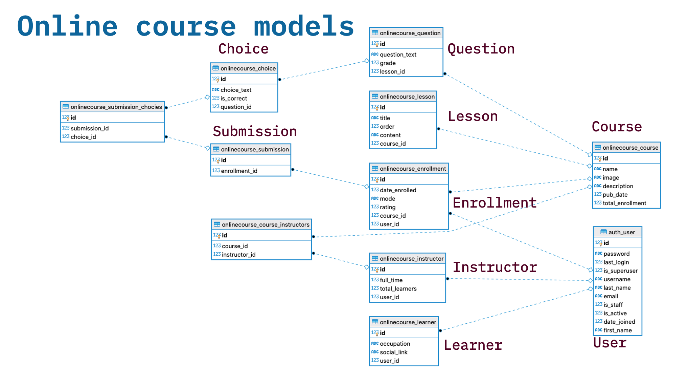

🧑‍🏫 Django Online Course Platform

This is a Django-based web application that allows users to register, log in, enroll in courses, view lessons, and submit answers for automated grading.
🚀 Features

    User Authentication

        Registration, login, logout

    Course Management

        View top 10 courses by enrollment

        Enroll and track enrollment status

    Assessment System

        Submit answers for multiple-choice exams

        Automated grading and result display

    Admin Panel

        Manage instructors, learners, courses, lessons, questions, and choices

**ER Diagram**
For your reference


## Setup Instructions

1. Clone the Repository
   Clone the repository to your local machine:
    ```
    git clone https://github.com/yourusername/personal_finance_tracker.git
    cd personal_finance_tracker
    ```
   
2. Set up the Virtual Environment

   It’s a good practice to use a virtual environment. To create one:
     ```
     python -m venv .venv
     ```
    Activate the virtual environment:
    On Windows: 
     ```
    .venv\Scripts\activate
     ```
    On macOS/Linux:
     ```
    source .venv/bin/activate
     ```
   
3. Install Dependencies

    Install the required dependencies using pip:
    ```
    pip install -r requirements.txt
    ```
   
4. Set up the Database using .env file
    ```
    DB_NAME=
    DB_USER=
    DB_PASSWORD=
    DB_HOST=
    DB_PORT=5432
    ```
   Run migrations to set up the database:
    ```
    python manage.py migrate
    ```

5. Create a Superuser

   Create a superuser to access the Django admin panel:
    ```
    python manage.py createsuperuser
    ```
   Follow the prompts to create a superuser.

6. Run the Development Server

   Start the Django development server:
    ```
    python manage.py runserver
    ```
    You can now access the application at http://127.0.0.1:8000/.

👨‍💻 Admin Access

Visit http://127.0.0.1:8000/admin and log in using your superuser credentials to manage:

    Courses

    Lessons

    Instructors & Learners

    Questions & Choices

📦 Models Overview

    User: Django's built-in user model.

    Instructor / Learner: Extended user profiles.

    Course: Contains name, description, image, etc.

    Lesson: Linked to a course with content and order.

    Enrollment: Links a user to a course.

    Question / Choice: Used for assessments.

    Submission: Stores a user's selected answers.

✅ Future Enhancements (Optional)

    User dashboard for enrolled courses

    Course progress tracking

    CRUD for the models

    Course completion certificates

    Video lesson integration

🛠️ Dependencies

    Python 3.8+

    Django 5.2.4

    Bootstrap (for UI styling) 
    
    Postgres DB


📄 License

This project is open-source and available under the MIT License.

